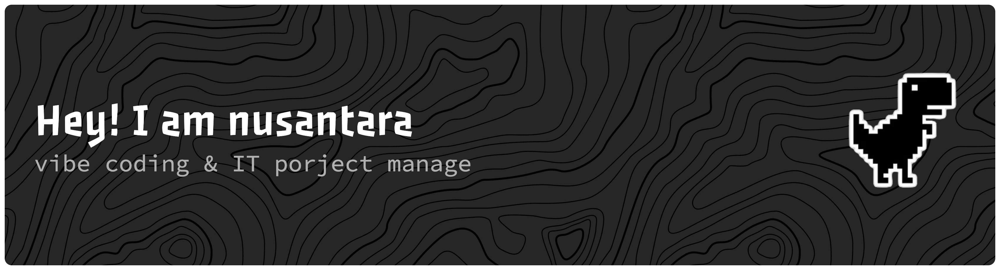

  
  
  
  
  
  
  

 

## Hi there 👋, I'm Rahmat Nusantara

I am an Information Systems undergraduate student and a freelance Web Developer & IT Support Specialist based in Bali. I enjoy building structured web applications, managing databases, and configuring reliable network infrastructures.

Here is a bit more about what I do:

- 🔭 **I’m currently working on:** Web-based management systems (like sales inventory and PWA attendance platforms) and setting up network hardware (CCTV, Access Points, IP PBX).
- 🌱 **I’m currently learning:** Optimizing deployment workflows (Git/Docker) and advanced data processing using Python (Pandas).
- 👯 **I’m looking to collaborate on:** PHP-based web applications, especially those utilizing Laravel or CodeIgniter 4, as well as educational tech projects.
- 💬 **Ask me about:** PHP frameworks (CodeIgniter 4, Laravel), Tailwind CSS, MySQL database management, and local networking troubleshooting.
- 📫 **How to reach me:** [Masukkan Link LinkedIn / Email profesionalmu di sini]
- ⚡ **Fun fact:** I also teach robotics and visual block programming (Scratch)!

### 🛠️ Tech Stack & Tools

**Development:**
- PHP (CodeIgniter 4, Laravel)
- JavaScript, HTML, CSS, Tailwind CSS
- Python (Pillow, Pandas)

**Databases & Workflow:**
- MySQL (via TablePlus, MAMP, DBngin, XAMPP)
- VS Code, Git

**IT Support & Infrastructure:**
- Network configurations (Ruijie Routers, Wireless APs)
- Dinstar IP PBX & CCTV Systems
